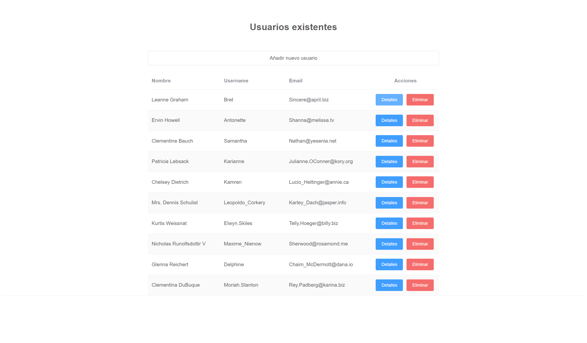
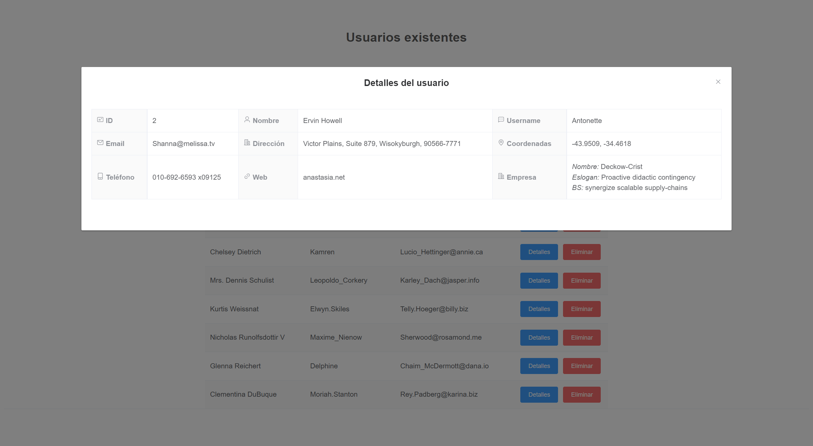
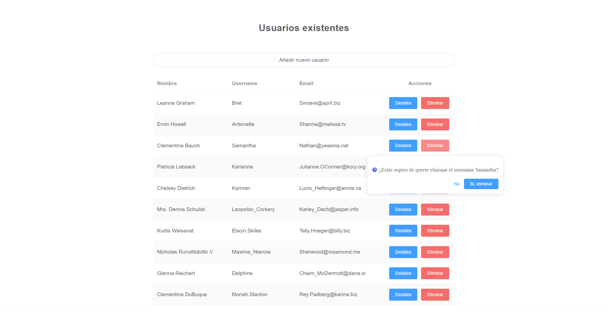
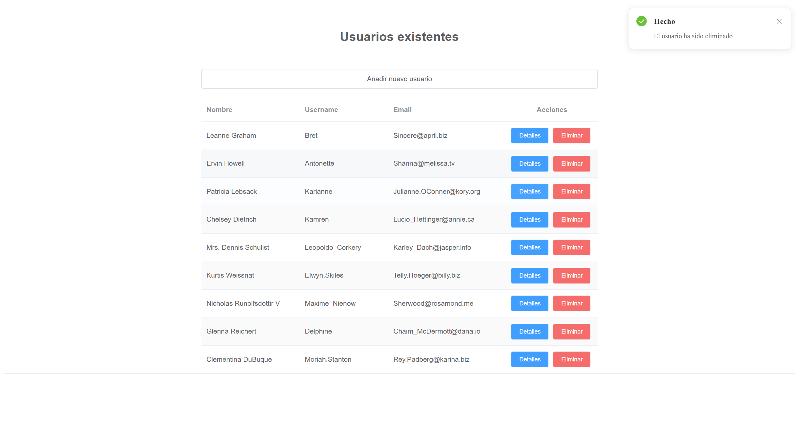
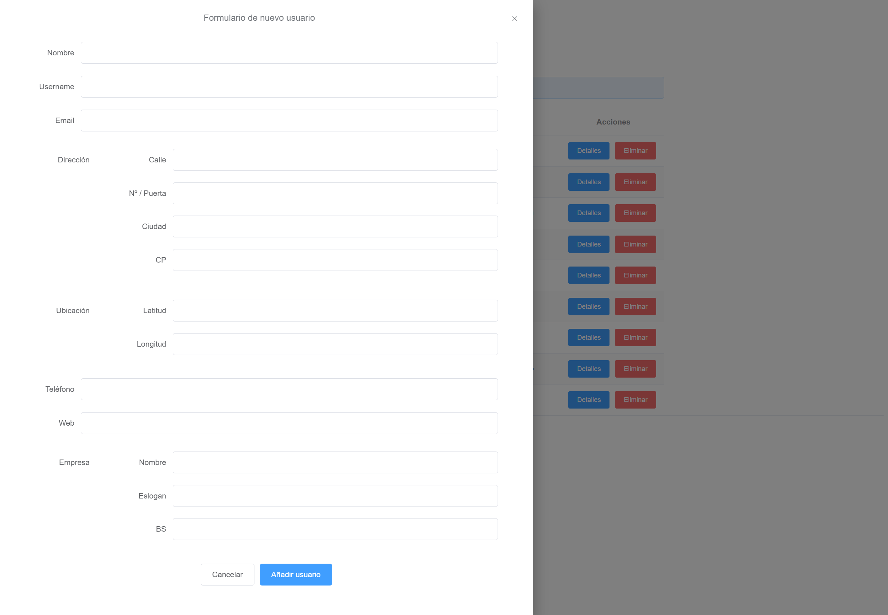

# prueba-vue3

# Frameworks/librerías:
- [x] [Vue3](https://vuejs.org/)
- [x] [Axios](https://github.com/axios/axios)
- [x] [Element Plus](https://element-plus.org/)


## Elementos de Element Plus utilizados en la prueb
- [x] [Button](https://element-plus.org/en-US/component/button.html)
- [x] [Table](https://element-plus.org/en-US/component/table.html)
- [x] [TableColumn](https://element-plus.org/en-US/component/table.html)
- [x] [Dialog](https://element-plus.org/en-US/component/dialog.html)
- [x] [Descriptions](https://element-plus.org/en-US/component/descriptions.html)
- [x] [DescriptionsItem](https://element-plus.org/en-US/component/descriptions.html)
- [x] [Icon](https://element-plus.org/en-US/component/icon.html)
- [x] [Notification](https://element-plus.org/en-US/component/notification.html)
- [x] [Popconfirm](https://element-plus.org/en-US/component/popconfirm.html)
- [x] [Drawer](https://element-plus.org/en-US/component/drawer.html)
- [x] [Form](https://element-plus.org/en-US/component/form.html)
- [x] [FormItem](https://element-plus.org/en-US/component/form.html)
- [x] [Input](https://element-plus.org/en-US/component/input.html)
- [x] [Loading](https://element-plus.org/en-US/component/loading.html)


## Respondiendo a la pregunta sobre el escenario propuesto
Para el ejemplo en cuestion simplemente con utilizar localStorage o almacenar los usuarios como cookie podría bastar.

De cara a producto de empresa me plantearía hacer uso de IndexedDB, un sistema de base de datos transaccional que MDN describe como "una base de datos orientada a objetos basada en JavaScript", permitiendo almacenar y recuperar objetos que están indexados con una clave.


## ¿Cómo hice la prueba?
- He creado un nuevo proyecto de Vue 3 con la instalación por defecto con babel y eslint.
```
vue create prueba-vue3
```
- Instalo el framework "Element Plus”, que utilizaremos sus componentes para el diseño. Solo instalo lo básico, lo que vaya a utilizar (importación por demanda) para ahorrar recursos.
```
vue add element-plus
```
- También instalo la librería “Axios” para las peticiones a la API.
```
npm install axios
```
- Modifico el archivo App.vue de la raíz para dejarlo como base, llamando dentro de este al componente UsersTable.vue, que será el que trabajaré a partir de ahora. También usaré el style de App.vue como genérico.

- Muestro los usuarios existentes en una tabla recogiendo solo los datos Usuario, Username y Email haciendo una petición a la API pública aportada, esto se ejecuta cuando carga el DOM, usando el ciclo de vida mounted().

- Añado dos botones, uno para los detalles y otro para eliminar en cada uno de los usuarios. 

- El botón e los detalles abrirá un componente “Dialog” al que añadimos iconos.

- Instalo el paquete con los iconos.
```
npm install @element-plus/icons-vue 
```
- El botón de eliminar preguntará antes de ejecutarse, usando el componente “Popconfirm”, una vez confirmemos usamos de nuevo la API para ejecutar la petición tipo POST con axios para eliminar al usuario seleccionado. Una vez recibida la respuesta 201, usaremos el método splice de JavaScript para así conseguir eliminar la fila seleccionada de la vista.

- Añado otro botón en la parte superior para añadir usuarios, acompañado de un componente “Drawer” en el que nos aparecerá el formulario para rellenar los datos del nuevo usuario. 

- Termino el formulario con un botón que hace uso del componente “Loading”, para que sea algo más vistoso e intuitivo. Hago un push sobre la lista de usuarios para que me aparezca este nuevo usuario en la vista.

- Por último usaremos también el componente “Notification” para que nos avise cuando ejecutemos los métodos de añadir/eliminar usuarios, y nos devuelva diferentes notificaciones en caso de éxito o error.


Me gustaría haber añadido también reglas (rules) y hacer uso de required en los inputs del formulario de nuevo usuario, pero creo que ya era extender la prueba demasiado.


## Capturas de pantalla







## Project setup
```
npm install
```

### Compiles and hot-reloads for development
```
npm run serve
```

### Compiles and minifies for production
```
npm run build
```

### Lints and fixes files
```
npm run lint
```

### Customize configuration
See [Configuration Reference](https://cli.vuejs.org/config/).

